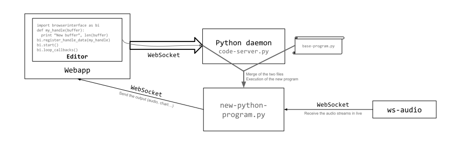

# Intro

Here is the global structure of the project, and how the different parts interact.

## Overview

The system is divided in three parts:

1. Daemons in C running on the board;
2. A Python daemon running on the client computer;
3. A webapp executed on the client computer.

These three parts communicate using [WebSockets](https://en.wikipedia.org/wiki/WebSocket) (basically a TCP connection, that you can use easily in Javascript, in browsers).

## On the Board

There are three daemons running on the board, all in C:

1. The `main-daemon` is the main part of the system, and the only one interacting with the microphones through ALSA API;
2. The `ws-audio` is a first bridge between the main daemon and a WebSocket, allowing external clients to access the audio streams;
3. The `ws-config` is a second bridge between the main daemon and a WebSocket, allowing external clients to change the configuration of the microphones.

These three daemons communicate together using TCP connections over UNIX sockets.

### The Main daemon

This daemon can receive in live the audio streams from the microphones using ALSA API, and can also send a new configuration using the same API.
Then it listens on two UNIX sockets using TCP: `/tmp/micros-audio.socket` and `/tmp/micros-control.socket`.

It sends the audio stream to every client connected to the first socket, and can receive a new audio configuration from the second socket.
The idea is to provide the most basic functionnalities with this daemon, that can be extended using other programs which communicate with it using these two UNIX sockets.

### WSAudio

The WSAudio daemon connects to the main daemon using the UNIX socket `/tmp/micros-audio.socket`, so it receives the audio streams in live.
It also listens on the port 7321 using WebSocket.
It will send the audio streams it receives to every connected client as binary messages.
It doesn't keep in memory the frames: each time it receives new data from the main daemon, it sends it to the connected clients.
When a new client arrives, it starts to receive the audio streams from this moment.

### WSConfig

The WSConfig daemon connects to the main daemon using the UNIX socket `/tmp/micros-control.socket`.
It also listens on the port 7322 using WebSocket.
When a client sends to it a configuration (using a text message containing JSON), it reads the JSON and sends the new information (using an array of integers) to the main daemon.
The main daemon will then interrupt its connection with ALSA, set the new configuration it just received and start again to receive the audio stream.

## On the client

There are two components on the client(s):

1. A Python daemon `code-server.py` that listens on a WebSocket and executes the Python code it receives on it;
2. The webapp `client.html`, which connects to `ws-audio` and `ws-config` so the user can listen to the audio streams and change the configuration, and also to the local Python daemon to which it can send Python code written by the user.

### Execution of Python code from the browser

In the webapp, there is an editor where the user can write some Python code.
When he/she clicks on *Execute* the code is sent to the local Python daemon.
Then the Python daemon includes the code to an existing Python program, `base-program.py` (at the end, it replaces the line `#####INSERT: Here insert code` with the code from the user), and executes it.

This new Python program will then connect to `ws-audio`, so it will receive the audio streams in live (and executes the code from the user on it), and it will also listen on a WebSocket (on a port around 7320 specified by the Python daemon, which communicated it to the webapp) to which the webapp will connect.
So this new Python program will have the possibility to work on the audio streams and to send the output (which can be plots data or a new audio stream) directly to the webapp.
The webapp also uses this connection to send the IP address of the board, so the Python script know how to connect to WSAudio.

More precisely, the user is invited to write his/her code inside a function (for example `my_handle_data(buffer)`) and to register it as a callback (using `browserinterface.register_handle_data(my_handle_data)`) so it will be called every time a new audio buffer is received from the `ws-audio` daemon.

The Python daemon will also catch the `stdout` and `stderr` streams and redirect them to the browser, so the user can easily access it.

### Execution of a Python script

It is also possible to write a Python script, that will use the library of the project to easily receive the audio, and to send output to the browser (if wanted).
In that cas the browser is just used as a vizualisation tool.
Just as previously, the script will connect to `ws-audio` and receive in live the audio streams.

However, this time, the outputs are not redirected, so you will be able to see them directly in your console, like any Python script.
The library will also choose a port around 7320 by itself, and will communicate it to the Python daemon, which will send it to the browser, so this last one can connects to the Python script and receive the output (plots or new audio stream).

So can also decide you don't need the browser and just use the connection to the audio stream, and any vizualisation library you want.

